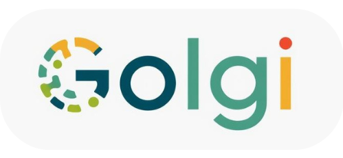

# 🧬 Golgi — A Healthcare Search Engine
**Making healthcare searchable.**  

[Golgi](https://goooolgi.streamlit.app/) is a Streamlit-based custom search engine for clinicians and researchers.  
It leverages LLM-powered search API to query medical & scientific evidence, then enhances the results with filtering, confidence scoring, and rich visual analytics.  

The Golgi apparatus in cells acts as a sorting, packaging, and distribution center for proteins. Similarly, Golgi the search engine acts as a distribution center for medical knowledge: sorting, organizing, and routing the right information to the right user at the right time.

---

## ✨ Features

- 🔎 **Smart search**: queries across clinical, academic, and trial sources  
- 🩺 **Clinical & Scholar modes** for strict or broad evidence gathering  
- 📊 **Analytics dashboard**:
  - Evidence type distribution (pie chart)  
  - Source/domain counts (bar chart)  
  - Confidence scores by rank (line chart)  
- **Results Report**: includes summaries + preview images from sources  
- 📥 **Export results** as JSON or CSV  
---

## 🛡️ Disclaimer

Golgi is a prototype for research and educational purposes only. It is not a clinical decision support tool. Always verify information from trusted medical sources before making healthcare decisions.
